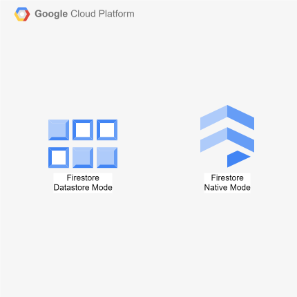

# cdktn-firestore-databases

CDKTN app that deploys two Firestore databases in the same GCP project.

This repository showcases a recently added new feature which allows to have [multiple Firestore databases within the same GCP project](https://cloud.google.com/blog/products/databases/manage-multiple-firestore-databases-in-a-project) (also of different types). Previously you were limited to a single Firestore database per project, always named `(default)`.

## Prerequisites

- **_GCP:_**
  - Must have authenticated with [Application Default Credentials](https://registry.terraform.io/providers/hashicorp/google/latest/docs/guides/provider_reference#running-terraform-on-your-workstation) in your local environment.
  - Must have set the `GCP_PROJECT_ID` and `GCP_REGION` variables in your local environment.
- **_mise:_**
  - [Install mise](https://mise.jdx.dev/installing-mise.html), which manages Node, pnpm, and OpenTofu.

## Installation

```sh
mise install
pnpm install
pnpm gen
```

`pnpm gen` generates the Google provider constructs into `.gen/`. Re-run it whenever the provider constraint in `cdktf.json` changes.

`pnpm synth`, `pnpm diff`, and `pnpm run deploy` all read `GCP_PROJECT_ID` and `GCP_REGION`; the stack throws without them.

## Deployment

```sh
pnpm run deploy
```

## Cleanup

```sh
pnpm destroy
```

## Architecture Diagram


