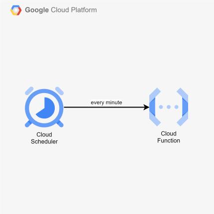

# cdktn-scheduled-function

CDKTN app that deploys a Cloud Function (2nd gen) and triggers it every minute with Cloud Scheduler.

## Architecture Diagram



## Prerequisites

- **_GCP:_**
  - Must have authenticated with [Application Default Credentials](https://registry.terraform.io/providers/hashicorp/google/latest/docs/guides/provider_reference#running-terraform-on-your-workstation) in your local environment.
  - Must have set the `GCP_PROJECT_ID` and `GCP_REGION` variables in your local environment.
- **_mise:_**
  - [Install mise](https://mise.jdx.dev/installing-mise.html), which manages Node, pnpm, and OpenTofu.

## Installation

```sh
mise install
pnpm install
pnpm gen
```

`pnpm gen` generates the Google provider constructs into `.gen/`. Re-run it whenever the provider constraint in `cdktf.json` changes.

`pnpm synth`, `pnpm diff`, and `pnpm run deploy` all read `GCP_PROJECT_ID` and `GCP_REGION`; the stack throws without them.

## Deployment

```sh
pnpm run deploy
```

## Cleanup

```sh
pnpm destroy
```

## How it works

The stack enables the APIs a 2nd gen function needs (Cloud Functions, Cloud Build, Artifact Registry, Cloud Run) plus Cloud Scheduler, zips `src/function/` as a `TerraformAsset`, and uploads it to a source bucket under a name derived from its hash, so any code change produces a new object and a rebuild.

`src/function/` is a Functions Framework handler with its own `package.json`. Cloud Build installs its dependencies during the build; it is not part of the pnpm workspace.

The function runs as its own service account. A second service account signs the scheduler's requests with an OIDC token, and it is the only identity granted `roles/run.invoker` on the Cloud Run service behind the function.
